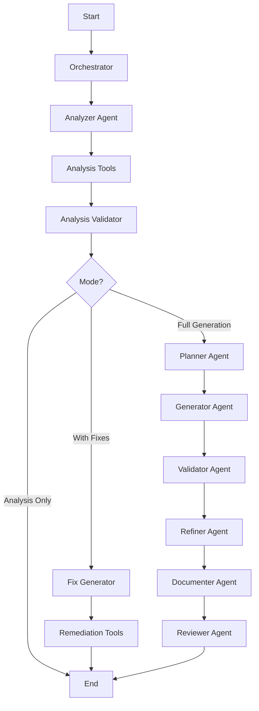

# Terraform Code Generation Agent

A comprehensive Terraform code generation agent that follows industry best practices and integrates with modern tooling for Infrastructure as Code (IaC) development. **Inspired by the AWS Well-Architected IaC Analyzer** but modernized with **LangGraph Platform**, **LangMem**, and **MCP integration** for cloud-agnostic analysis.

## Features

### 🏗️ Code Generation & Analysis
- **Well-Architected Framework Analysis**: Comprehensive analysis across 6 pillars (Security, Reliability, Performance, Cost Optimization, Operational Excellence, Sustainability)
- **Azure Verified Modules (AVM) Best Practices**: Implements comprehensive best practices from [Azure Verified Modules](https://azure.github.io/Azure-Verified-Modules/specs/tf/)
- **HashiCorp Template Structure**: Follows [hashi-demo-lab/tf-module-template](https://github.com/hashi-demo-lab/tf-module-template) structure
- **AWS Provider Focus**: Optimized for [HashiCorp Terraform AWS Provider](https://github.com/hashicorp/terraform-provider-aws)

### 🔧 Modern Architecture
- **LangGraph Platform**: Advanced workflow orchestration with state management and checkpointing
- **LangMem Integration**: Persistent context management for complex analysis workflows
- **MCP Integration**: Leverages [HashiCorp Terraform MCP Server](https://github.com/hashicorp/terraform-mcp-server) for registry access
- **Multi-tool Validation**: Integrates terraform, tflint, trivy, and checkov validation

### 🔍 Analysis Capabilities

#### Well-Architected Framework Categories
1. **Security**: Encryption, access controls, network security, secret management
2. **Reliability**: Multi-AZ deployments, backup strategies, auto-scaling, disaster recovery
3. **Performance**: Instance optimization, storage types, caching, monitoring
4. **Cost Optimization**: Resource tagging, lifecycle policies, right-sizing
5. **Operational Excellence**: Monitoring, logging, automation, documentation
6. **Sustainability**: Energy efficiency, resource optimization, carbon footprint

#### Analysis Modes
- **Analysis Only**: Comprehensive code review with detailed recommendations
- **Analysis with Fixes**: Automated remediation for critical and high-severity issues
- **Full Generation**: Complete workflow from requirements to production-ready code

## Quick Start

### LangGraph Platform Deployment

The agent is now fully compatible with LangGraph Platform for production deployment:

```bash
# Install LangGraph CLI
pip install langgraph-cli

# Local development
langgraph dev

# Build for deployment
langgraph build -t terraform-agent

# Deploy to LangGraph Platform
langgraph up
```

### Basic Analysis

```python
from src.workflows.analysis_workflow import TerraformAnalysisWorkflowManager, WorkflowMode

# Initialize the workflow manager
workflow_manager = TerraformAnalysisWorkflowManager()

# Analyze Terraform code
analysis_report = await workflow_manager.analyze_terraform_code(
    terraform_code=your_terraform_code,
    mode=WorkflowMode.ANALYSIS_ONLY
)

print(f"Overall Score: {analysis_report.score}/100")
print(f"Issues Found: {analysis_report.summary['total_issues']}")
```

### Analysis with Automated Fixes

```python
# Analyze and generate fixes
result = await workflow_manager.analyze_with_fixes(
    terraform_code=your_terraform_code
)

analysis_report = result["analysis_report"]
fixed_code = result["fixed_code"]
fixes_applied = result["fixes_applied"]
```

### Full Generation Workflow

```python
# Define infrastructure requirements
requirements = {
    "provider": "aws",
    "resources": [
        {
            "type": "s3_bucket",
            "encryption": True,
            "versioning": True,
            "public_access": False
        }
    ],
    "compliance": ["security", "reliability"]
}

# Generate complete infrastructure
result = await workflow_manager.full_generation_workflow(
    requirements=requirements
)
```

## Architecture

### LangGraph Platform Workflow



### Agent Architecture

- **Analyzer Agent**: Core analysis engine implementing Well-Architected Framework rules
- **Orchestrator Agent**: Workflow coordination and state management
- **Fix Generator Agent**: Automated remediation for identified issues
- **Planner Agent**: Requirements analysis and resource planning
- **Generator Agent**: Code generation with best practices
- **Validator Agent**: Multi-tool validation orchestration
- **Refiner Agent**: Iterative code improvement
- **Documenter Agent**: Auto-documentation generation
- **Reviewer Agent**: Final quality assurance

## Analysis Rules Engine

The agent includes a comprehensive rules engine covering:

### Security Rules (SEC-001 to SEC-005)
- Encryption at rest and in transit
- Network security group restrictions
- Public access controls
- MFA requirements
- HTTPS enforcement

### Reliability Rules (REL-001 to REL-004)
- Multi-AZ deployments
- Backup configurations
- Versioning strategies
- Auto-scaling setup

### Performance Rules (PERF-001 to PERF-003)
- Instance type optimization
- EBS optimization
- Storage type selection

### Cost Optimization Rules (COST-001 to COST-003)
- Resource tagging for cost allocation
- Reserved instance recommendations
- Lifecycle policy implementation

### Operational Excellence Rules (OPS-001 to OPS-003)
- Monitoring and logging
- Resource naming conventions
- Operational tagging

### Sustainability Rules (SUS-001 to SUS-003)
- Energy-efficient instance types
- Auto-scaling for efficiency
- Resource right-sizing

## Documentation

- **[Azure Verified Modules Best Practices](./AVM_BEST_PRACTICES.md)** - Comprehensive guide to AVM best practices
- **[Cursor Rules](./.cursorrules)** - Development rules and standards for the agent
- **[Performance Evaluation](./PERFORMANCE_EVALUATION.md)** - Framework for evaluating agent performance
- **[Analysis Examples](./examples/analysis_example.py)** - Practical usage examples

## Module Classifications

The agent supports three types of Terraform modules:

- **Resource Modules**: Single-purpose modules for specific cloud resources
- **Pattern Modules**: Multi-resource modules implementing common architectural patterns
- **Utility Modules**: Helper modules for common operations and transformations

## Best Practices Implementation

This agent implements industry-leading best practices including:

- **Snake_case naming conventions** across all resources
- **Comprehensive variable validation** with custom rules
- **Security-first approach** with encryption by default
- **Consistent resource tagging** for management and cost allocation
- **Auto-generated documentation** with terraform-docs
- **Comprehensive testing strategies** including unit and integration tests
- **Telemetry and monitoring integration** for operational excellence

## Integration Points

- **Version Control**: Git integration for module versioning
- **CI/CD**: GitHub Actions/GitLab CI templates
- **Monitoring**: Prometheus metrics and Grafana dashboards
- **Cloud Integration**: Support for Terraform Cloud/Enterprise
- **Registry Access**: Automated provider and module discovery through MCP tools
- **IDE Integration**: Cursor/VS Code extension support

## Examples

### Running Analysis Examples

```bash
# Install dependencies
pip install -r requirements.txt

# Run comprehensive examples
python examples/analysis_example.py
```

The examples demonstrate:
- Basic Terraform code analysis
- Automated fix generation
- Code quality comparison
- Category-specific analysis
- Full generation workflow

### Example Output

```
🔍 Terraform Code Analysis Example
==================================================

📊 Analysis Results:
   Overall Score: 45.2/100
   Total Issues: 12
   Critical: 2
   High: 4
   Medium: 4
   Low: 2

🚨 Top Critical/High Severity Issues:
   1. [CRITICAL] Overly permissive security group rule
      Resource: aws_security_group.web
      Category: security
      Recommendation: Restrict CIDR blocks to specific IP ranges

   2. [HIGH] Encryption not enabled
      Resource: aws_s3_bucket.example
      Category: security
      Recommendation: Enable server_side_encryption_configuration
```

## Contributing

We welcome contributions! Please see our [Contributing Guidelines](./CONTRIBUTING.md) for details on:

- Code style and standards
- Testing requirements
- Pull request process
- Issue reporting

## License

This project is licensed under the MIT-0 License. See the [LICENSE](./LICENSE) file for details.

---

**Inspired by**: [AWS Well-Architected IaC Analyzer](https://github.com/aws-samples/well-architected-iac-analyzer)  
**Modernized with**: LangGraph Platform, LangMem, and MCP integration  
**Focus**: Cloud-agnostic Terraform best practices and automated analysis